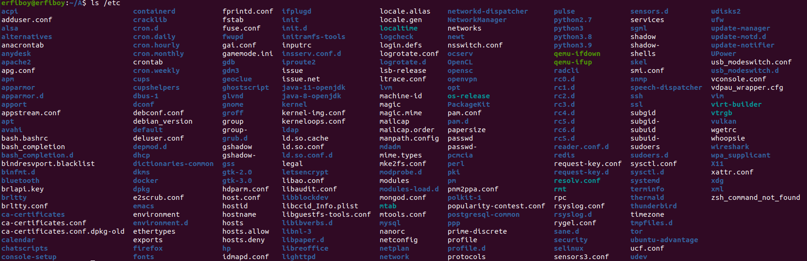
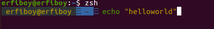

# **Introduction to Linux**

## ‫‪1. Virtual‬‬ ‫‪Machine‬‬

### What is the diffrence between NAT‬‬ ‫‪Bridged‬‬ ‫‪Host‬‬ ‫‪-‬‬ ‫‪Only‬‬ ?
> #### Network Address Translation (NAT) 

- This configuration will be create a virtual router on the host and all the trafic will pass through the host which the Virtual machine is running on.The IP of the VM is the subnet of the host IP and all VM's IPs are diffrent.

> #### Bridged‬‬ ‫‪Host
 - This configuration will be create an IP address on the same domain as host. And it is like having another machine on that network.

> #### Host‬‬ ‫‪-‬‬ ‫‪Only
- This configuration will be create a local network and VMs will only see the other VMs on that host and don't have access to the internet.

## 2. ‫‪System‬‬ ‫‪Configuration‬‬

## 3. ‫‪Command‬‬ ‫‪Line‬‬

### 3.1 installing, run and remove fortuneInstalling fortune:
> $ sudo apt install fortune  

Run the fortune:

> $ fortune  
> output:  "Elves and Dragons!" I says to him.  >"Cabbages and potatoes are better
>for you and me."
> 		-- J. R. R. Tolkien

See the installed packages 
> $ apt list 

See the specified package 

> $ apt list | grep fortune

Removing fortune:

> $ sudo apt remove fortune 
> $ sudo apt remove fortune-mod 
> output: Reading package lists... Done  
Building dependency tree        
Reading state information... Done 
The following packages were automatically installed  and are no longer required:
   fortunes-min librecode0
 Use 'sudo apt autoremove' to remove them.
 The following packages will be REMOVED:
  fortune-mod
 0 upgraded, 0 newly installed, 1 to remove and 27 not upgraded.
 After this operation, 110 kB disk space will be freed.
 Do you want to continue? [Y/n] y
 (Reading database ... 274215 files and directories currently installed.)
 Removing fortune-mod (1:1.99.1-7build1) ...
 Processing triggers for man-db (2.9.1-1) ...

See the installed packages 
> $ apt list 

See the specified package and make sure that it has been removed

> $ apt list | grep fortune

### 3.2 Directories
Go to Home:
> $ cd  

Create A and B directories in Home:
> $ mkdir A B

Go to A with the absolute path:
> $ cd ~/A

Go to B with reletive path:
> $ cd ../B 

Create a file which is golab, in A directory
> $ touch golabi

Copy golabi to A directory:
>$ cp golabi ../B

Move golabi to Desktop:
>$ mv golabi ~/Desktop/

Remove the directory B with the flag -r:
>$ rm -r ~/B

### 3.3 ls

#### usefull Flags
To list all files in the current directory, type:
> ls -a

This displays a long listing with detailed information:
> ls -l

This displays a list all the files with detail:
> ls -la

This displays files that were modified most recently:
> ls -x

This displays lists all subdirectories recursively:
> ls -R

This displays size of all files:
> ls -s

### 3.4 tree
<pre>
-d     List directories only.
-l     Descend only level directories deep.
</pre>
> $ tree -L 2 -d

### 3.5 suffix
change the suffics of the sqspell to jpg
> $ mv sqspell.php sqspell.jpg
> 

### 3.6 Zsh

For installing the ‫‪syntax-highlighting‬‬ and ‫‪utocomplete‬‬ you can use [this link](https://linuxhint.com/install_zsh_shell_ubuntu_1804/).

## 4 ‫‪Linux‬‬ ‫‪Security‬‬ ‫‪and‬‬ ‫‪Permissions‬‬

Create a user with that it's username is equal to student name:
> $ sudo adduser --force-badname 97102558 
> Adding user `97102558' ... 
Adding new group `97102558' (1001) ... 
Adding new user `97102558' (1001) with group `97102558' ... 
Creating home directory `/home/97102558' ... 
Copying files from `/etc/skel' ... 
New password:  
Retype new password:  
passwd: password updated successfully 
Changing the user information for 97102558 
Enter the new value, or press ENTER for the default 
	Full Name []:  
	Room Number []:  
	Work Phone []:  
	Home Phone []:  
	Other []:  

Switch to user:
> $ su 97102558

Create a new user with 97102558:
This instruction cause an error.
> $ adduser ali  
>adduser: Only root may add a user or group to the system.

To correct this error we must add the current user to the sudo group:
> $ sudo usermod -aG sudo 97102558

To delete the user:
> $ sudo deluser --remove-home 97102558

## 5 ‫‪Regular‬‬ ‫‪Expressions‬‬